# 构建电子商务网站

**翻译：伟太**

在一个相对较短的20年来，在互联网上销售产品和服务已经从新奇事物变成企业的主流业务。如果你的公司没有提供一个在线渠道给你的目标客户，你正错过一个增加收入、市场份额以及盈利的巨大机会。Drupal Commerce 为构建在线店面提供了强健而且功能完整的解决方案。在本章中，我将带您完成创建一个电子商务网站的流程。为了演示在 Drupal 上建立电子商务网站的简易，我将创建一个专注于销售 Drupal T恤，咖啡杯和帽子的网站。该概念可以扩展到出售任何物理或虚拟货物，所以欢迎你跟着我一起构建Drupal的电子商务网站，或者使用呈现的例子作为指导，来创建你自己的电子商务网站。

## 确定电子商务网站的需求

正如你多次在本书中读到，下手构建任何网站的开始是，确认该网站的需求。

本章介绍的示例电子商务网站的需求对许多电子商务网站来说是常见的，包括：

1. 在网站上展示在售产品的能力。
2. 销售具有特定属性（比如说产品尺寸）的产品的能力。
3. 购物者把产品放进购物车并管理购物车的能力。
4. 购物者结账和支付，包括提供信用卡结账以及选择送货方式，的能力
5. 购物者访问网站并且检查以前的订单的能力。

需求在手，我们接着就可以确定我们将如何使用 Drupal 来满足这些需求。使用 Drupal Commerce Kickstart 发行版，在此基础上创建店面。Commerce Kickstart 提供了一个预配置的解决方案，使得许多需求开箱即可实现，包括:

- 用于在网站上创建和展示产品的产品模板，包括具有属性（比如尺寸）的产品。
- 一个可以让访问者将产品放进购物车，并且在购物体检中管理商品的购物车系统。这个购物体检包括拥有多种支付方式的结账流程以及为产品（实物产品）选择运送方式。
- 用以查看过往订单的客户界面

作为一个 Drupal 发行版，Drupal Commerce Kickstart 发行版是由一个团队装配的。这个团队已经将所有贡献模块准备到位，使得你的店面搭建变得容易，并且用最少的功夫让网站迅速运行起来。你也可以跟随 Commerce Kickstart 团队的路径，找到所有相关的模块并且分别安装。这两种方案我都试过，我发现使用 Kickstart 明显更加快速、简单，所以我会现在更加容易示范的路径，使用 Commerce Kickstart 开始。

## 安装 Drupal Commerce Kickstart

安装 Drupal Commerce Kickstart 的过程除了定制的安装界面，几乎跟安装 Drupal 8 核心 一样。 按照说明下载 Drupal Commerce Kickstart (www.drupal.org/project/commerce_kickstart) 到你的 Web 服务器的一个目录中， 执行跟安装 Drupal 核心 一样的基本步骤。创建数据库和数据库用户，然后在你的浏览器中打开网站开始安装过程。

这个过程的第一步是接受隐私政策以及用户协议。这个跟安装 Drupal 8 不一样，因为这个发行版中包含有请求隐私政策以及用户协议同意的第三方库（见图22-1）。如果你同意这些条款，请点击 “Let's Get Started（让我们开始）” 按钮。

**图22-1 确认接受隐私政策以及用户协议**

这个过程的下一步是验证安装要求，以便继续进行安装。如果你还没创建 `/sites/default/files` 目录以及 `settings.php`，你可以去创建。这些步骤跟安装 Drupal 8 核心一样，在文件管理系统中导航到相应的位置并创建它们两个。

验证系统需求验证之后，下一步是指定数据库类型，数据库名称，数据库用户和数据库密码。
除了有一点点区别之外，这个过程跟安装 Drupal 8 核心一样（见图22-2）。你将需要（提前）创建那个数据库，或通过你的主机提供商的管理界面，或者在命令行中使用 MySQL，又或者采用像 PHPMyAdmin 这样的工具来创建这个数据库。

**图22-2 数据库设置**

输入数据库设置并点击“保存并继续”按钮之后，Drupal Commerce 会在数据库中创建必要的表，并执行所有关于 Drupal 8 核心以及与“ Drupal Commerce基础实现”关联的贡献模块的安装、启用操作。图22-3 显示了安装进度。

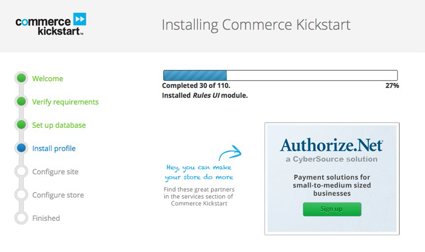

**图22-3 正在创建数据表并启用模块**

这个过程的下一步是填写你网站的基本信息，具体包括你网站的名称、商店的e-mail地址，商店管理员的用户名和密码，以及商店的国家和时区信息（见图22-4）。商店信息输入完成之后，点击“保存并继续”按钮。

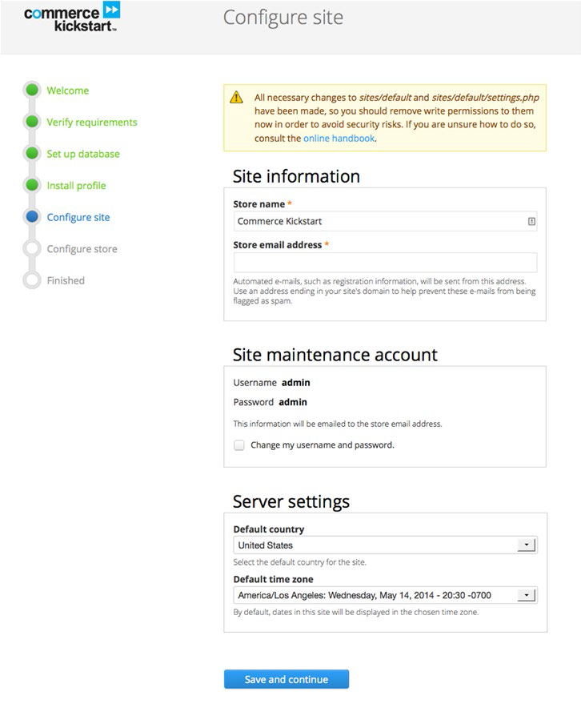

**图22-4 网站配置参数**

这个过程的最后一步是，决定你是否想要从一个示范商店开始，你是否希望将你的网站内容翻译成多语言，你网站的基础货币是什么，以及如果有需要的话，你的网站使用哪一种类型的税率（见图22-5）。为了演示如何建立一个商务网站，我将不会安装那个示范商店，但是我会启用其他所有附加功能来开始创建一个新的商店，而且我会启用美国税率。

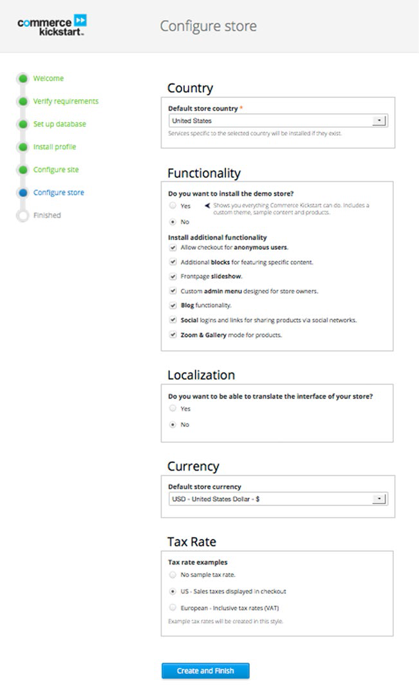

**图22-5 配置商店**

点击“创建并完成”按钮，Drupal Commerce 会安装额外的功能并且完成安装流程。访问网站的主页，你可以看一个“入门”弹出窗口，为你提供有关设置网站的丰富信息。我建议你找个时间将它通读一遍。关闭那个弹出窗口会显示默认主页，类似于图22-6。

## 设置产品分类

Commerce Kickstart 提供了一个用分类对产品进行分组的机制，这样网站访问者可以根据你定义的分类来浏览商品。完成安装 Kickstart 之后，你可以看到页面左上角有“Sample Category 1（示例分类一）”、“Sample Category 2（示例分类二）”的链接。对于我们的示例网站，我们会将这些分类改为杯子跟T恤，并添加第三个分类，帽子。

要管理分类，点击（悬停至，译者注）管理菜单的 “Products（产品）” 链接，点击下拉菜单中的“Categories（分类）”。在分类页面，单击“Product category（产品分类）”的 “List term（列出术语）” 链接，然后编辑 “Sample Category 1” 为 “Shirts（T恤）” ，接着编辑 “Sample Category 2” 为 “Cups（杯子）”。点击 “Add term（添加术语）” 为 “Hats（帽子）”添加新的分类。完成上面的修改并添加“帽子”分类后，分类列表应该如图22-7。单击 “Save（保存）” 。

**图22-7 产品分类**

## 设置产品

Drupal Commerce 使用产品类型的机制来创建产品信息。把产品类型当做 Drupal 8 核心里面的内容类型。 一个产品类型包含一组的用来描述你正在出售的产品的字段，包括如产品标题，SKU，价格，产品图片等要素。你可以有一个或者多个产品类型。创建多个产品类型主要是因为用来描述你正在出售的各种产品的字段之间存在着明显差异。举个例子，我们假设你要出售T恤和电影。用来描述T恤的字段（例如，材料，颜色，尺寸）跟用来描述电影的字段（例如，流派，评价，演员，时长）显著不同。在这种情况下，为电影单独创建一个产品分类会是合理的。Commerce Kickstart 使用术语 “variations（变型）” 作为产品类型的标签（而现成的 Drupal Commerce 使用“产品类型”）。

要查看 Commerce Kickstart 里面的变型，点击管理菜单上的“Store settings（商店设置）”，在下拉菜单中点击“Variation types（变型类型）”。“变型类型”页面（见图22-8）中列出了网站上已经定义的所有的产品变型。点击产品变型的“管理字段”链接，关于产品类型的所有字段就会显示出来，使用的用户界面跟 Drupal 8 核心的内容类型一样。你可以添加字段，重新排列字段，并控制产品的展示。

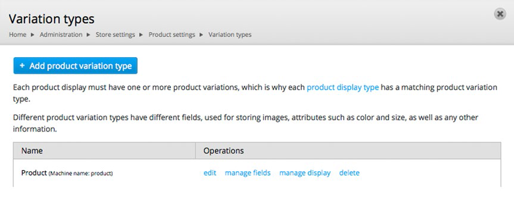

**图22-8 产品变型**

现成的产品变型包含了标题，SKU，价格和图片字段。虽然这可以很好地用于我们将要在网站上出售的咖啡杯，但是他并不适用于T恤，因为我们需要指定颜色和尺寸，而且对于帽子来说，我们需要指定颜色而不是尺寸。这个问题的解决方案是创建两个新的产品款式类型（产品变型），一个用于帽子，一个用于T恤。

要创建一个产品款式类型，点击“Variation types（商品款式类型）”页面（见图22-8）上的“Add product variation type（添加商品款式类型）”按钮，并给它一个名字“shirts（T恤）”。勾选“编辑时默认为这个产品款式类型的产品创建新的修订版”和“创建匹配的产品展示类型”。

-----

**注意** 一个匹配的产品展示实际上是一个用来展示商店产品的内容类型。Drupal Commerce 习惯性地将产品的展示以及产品的信息存储分离。这意味着要展示一个产品，你需要一个产品款式类型、和一个用来展示产品的内容类型。Commerce Kickstart 将这个过程变得简单一些。通过勾选“创建匹配的产品展示类型”选项框，Drupal 会自动创建用来展示产品的内容类型。

-----

点击“保存并添加字段”后，唯一我们需要做的是在字段管理页面上添加一个图片字段，一个颜色的选择列表，一个尺寸在的选择列表，如图22-9所示。Kickstart 自带预设置的图片字段，所以只需在“选择一个已有字段”的列表中选择那个字段。要添加颜色选择列表，创建一个新的“列表（文本）”字段来提供颜色选项。给字段命名为“Color（颜色）”并选择“列表（文本）”之后，在控件一列中选择“选择列表”。点击“保存”按钮，然后以“名|值对”（例如：白色|白色）的形式输入一列可用的颜色选项。点击“保存字段”的设置按钮，在这个字段最后的配置表单中，勾选“启用此字段作为属性字段添加到购物车表单中”，这样购物车就可以在添加商品到购物车时指定颜色。点击“保存设置”按钮完成颜色字段配置。遵循同样的步骤创建“Size（尺寸）”字段。字段添加完成之后，T恤产品类型应该如图22-9。

**图22-9 T恤内容类型（应该为T恤产品变型）**

添加字段后，还有一些其他的任务要执行。首先，整理T恤变型的展示。点击屏幕上方的“管理显示”选项卡，隐藏图片字段的标签。点击页面顶部“添加到购物车确认视图”的链接，看看有哪些值会出现在“购物车确认”页面中。将标题，尺寸颜色添加到显示，这样购物者可以更完整地看到什么在他们的购物车里面。为“购物车中的产品”、“行项”、“节点：摘要”显示模式进行同样的设置。

我们还需要对为展示T恤而自动创建的内容类型进行一些修改。点击“站点设置”，并在下拉菜单中点击“结构”链接。在“结构”页面，单击“内容类型”链接可查看商店中创建的内容类型的列表。从列表中，点击T恤内容类型的“编辑”链接，并进行以下更改：

1. 点击“评论设置”选项卡，将“新内容的默认评论设置”设置为“隐藏”。因为我们不希望客户提交关于T恤的评论。
2. 点击页面上方的“管理字段”选项卡（见图22-9）。我们需要为内容类型添加两个字段：一个“正文”字段，一个“产品分类”字段。这些字段用于在我们的示例网站上推销产品，并且属于产品展示而不是产品。幸运的是，这两个字段作为默认的 Kickstart 实现的一部分已经存在了，所以我们需要做的是使用“添加已有字段”来添加它们俩。
3. 点击页面上方的”管理显示“选项卡，对T恤显示方式做一些修改：
    
    * 确保标题的标签设置为隐藏
    * 将“产品：标题”移动到隐藏列表当中，因为我们已经有一个标题字段了
    * 将产品价格移动到列表的第二位
    * 将正文字段移动到列表的第三位，并隐藏其标签
    * 移动“产品：颜色”， “产品：尺寸”和产品分类字段到隐藏区域，因为颜色跟尺寸会作为产品变型显示的一部分出现。
    * 保存修改。    

4. 通过页面上方的“摘要”链接，进入“摘要”显示设置，以进行下面的更改。

    * 将除了标题，“产品：价格”，产品变型，“产品：图片”的所有字段移动到隐藏区域
    * 将“产品：图片”字段移动到第一位
    * 隐藏产品变型的标签
    * 保存修改

5. 更新“管理显示”选项卡下面的“产品列表显示”，如下：
    
    * 将“产品：图片”字段移动到第一位
    * 将“产品：标题”字段隐藏，因为我们已经有标题字段
    * 移动价格字段放在需要显示的字段中的最后一位
    * 保存修改

T恤、杯子都按照同样的步骤进行修改。同时添加一个不含尺寸字段的“帽子”商品款式类型，因为帽子只有一个尺寸。

## 创建产品

创建完T恤，帽子的商品款式类型之后，是时候对它们进行测试，确保它们以像想要的方式工作。我将创建一个新的T恤，“Drupal Flys T恤”。跟着这个例子来，请点击主菜单上面的“产品”按钮并点击下拉菜单中的“添加一个产品”。在操作列表中选择“T恤”，并在标题字段中输入“Drupal Flys”。这里是有趣的开始；我们需要为想要出售的每一个颜色和尺寸组合创建变型（款式）。例如，我们希望出售四个尺寸的白T恤，所以我们需要在“颜色”下拉菜单中选择白色，并且对每一个尺寸，在“尺寸”列表中选择一个(译者注：每一个产品颜色尺寸组合都需要一个产品变型，或者说产品款式)。为颜色和尺寸组合输入SKU码，在“分类”下拉菜单中选择“T恤”，设置价格并添加图片。为了这次演示，所有的图片都使用蓝色T恤。填充完第一个款式（变型）之后，表单应该如图22-10。

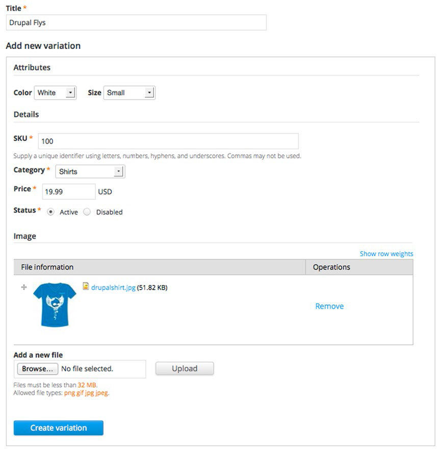

**图22-10 正在创建产品变型（款式）**

填完第一个款式（变型）之后，点击“创建款式（变型）”按钮。下一步是创建我们想要出售的所有款式，选择颜色和尺寸，为每一个颜色尺寸组合设置唯一的SKU码。通过点击“添加新的产品款式（变型）”来启动进程，按着上面段落中提到的步骤为每一个颜色和尺寸组合添加新的款式（变型）。最后的结果是一个长长的产品款式列表，部分显示出来的列表如图22-11。

**图22-11 产品变型（款式）列表**

保存“Drupal Flys T恤”后，该产品面向客户的视图，如图22-12所示。

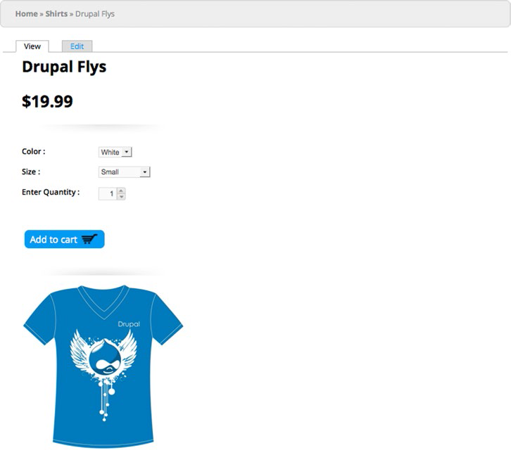

**图22-12 Drupal Flys T恤**

添加一个小码的白色“Drupal Flys T恤”到我的购物车。Kickstart 会在购物车中，以我在为T恤设置产品变型模板进行配置时定义的形式显示项目（见图22-13）。

**图22-13 项目被添加到购物车**

继续构建示例电子商务网站，跟随“Drupal Flys T恤”一样的步骤创建一个示例帽子和一个示例咖啡杯，唯一例外的是，帽子会有多种颜色而没有多种尺寸，杯子只会有一种颜色以及一个尺寸。 我会使用“帽子产品变型”来创建一个帽子而使用通用的“产品展示”来创建一个杯子。

如果我现在点击页面上方的分类链接，点击“Cups（杯子）”，页面会展示我创建的那个杯子；点击“Shirt（T恤）”，页面会展示“Drupal Flys T恤”，点击“Hats（帽子）”，页面会展示我创建的那顶帽子。

## 展示产品

要在你的店面上展示产品，有许多事情可以做。你可以将单独的产品链接添加到菜单，或者在内容中嵌入链接。你可以通过点击靠近页面上方的“分类”，像示例中演示的那样使用分类列表的方法，或者你可以创建视图来展示产品，基于你在这个视图上应用的标准以及过滤机制。作为一个例子，我将创建一个产品列表视图，用来展示网站上的所有产品，并按分类排序、分组。跟着一起来，将鼠标移动到管理菜单的“站点设置”链接上，然后点击下拉菜单中的“视图”链接。

点击视图页面中的“添加视图”按钮，在“添加视图”页面（见图22-14），进行以下操作：

1. 给视图一个名字；在这里我叫它做“产品”。
2. 在“显示”选择列表中选择了“Commerce 商品”，来指示在视图中显示什么。
3. 将要显示的产品类型保留为“全部”，因为我们想要显示所有的产品类型。
4. 让视图设置为“不排序”。
5. 点击“继续编辑”按钮。

**图22-14 正在创建产品视图**

在视图的配置页面中，我会遵循创建视图的基本步骤，使用来自“Commerce 商品”的字段，包括一个名叫“添加到购物车”的字段，这个字段允许访问者通过简单点击一个“添加到购物车”按钮将产品添加到他们的购物车。图22-15展示我为创建视图而进行的基本设置。

**图22-15 正在配置产品展示视图**

基于我对视图如何在网站上展示的构想，我会添加一个区块并且/或者页面展示，这样可以就可以将产品罗列在一个页面或者在菜单（页面）中提供一个视图的链接。图22-16展示视图可能会如何显示在网站上。

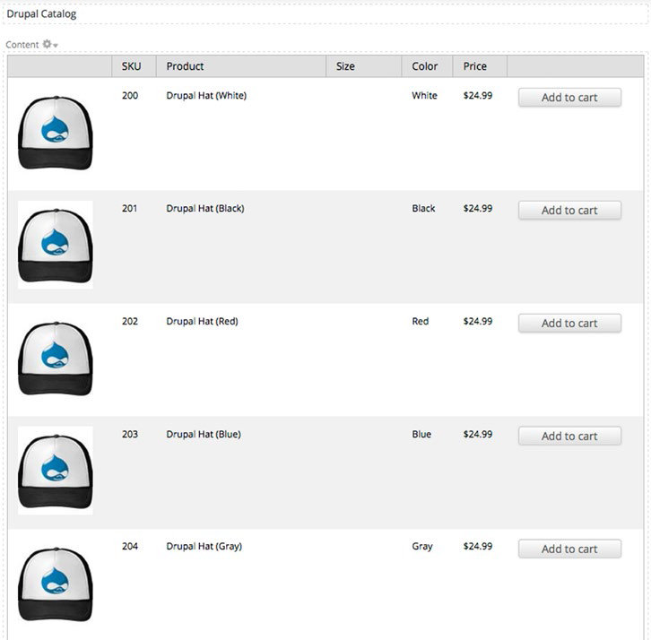

**图22-16 产品列表视图**

另外一个建议是添加筛选到你的视图，这样客户就可以快速地找到他们正在寻找的产品。使用视图筛选条件是提供这个功能的好方法。我已经将产品类型、产品颜色、产品尺寸的暴露的过滤器添加到视图，使得客户容易地将产品列表收缩到符合他们正在寻找的产品的条件（例如，黑色、中码的T恤）。图22-17显示过滤条件的设置细节以及最终在视图顶部出现的过滤器。

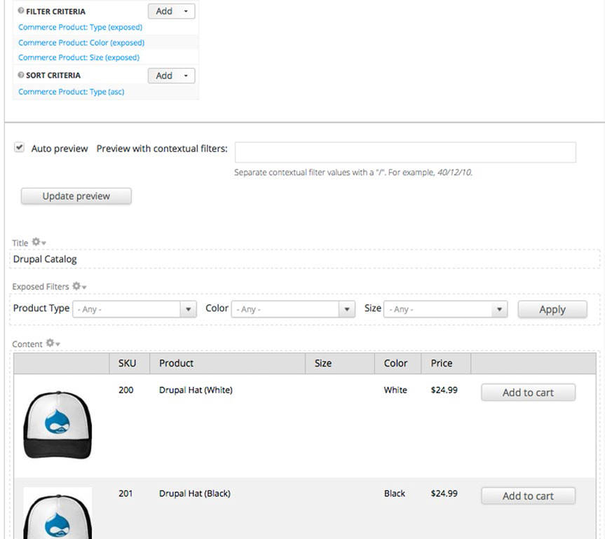

**图22-17 产品过滤器**

## 配送、税收、支付以及其他功能

有一些功能可以在Drupal Commerce 商店实现，其中包括的项目，如提供运费报价给购物者，计算增值税（VAT），以各种形式支付，提供折扣优惠券以及更多的功能。出于演示的目的，Kickstart 已经启用了带有预配置的多种功能。

### 配送

有几个 Commerce 贡献模块帮助提供配送选项，比UPS，美国邮政，以及其他。当你访问 www.drupal.org/project/commerce_shipping，你会发现有模块提供统一费率、UPS，FedEx，美国邮政，佳能打邮政，ConnectShip以及 Kiala选项支持。如果你想要的配送方法在模块列表中无法找到，也会有开发者API为创建新的配送方法的提供能力。

Kickstart 自带启用免费的运送方式。然而，出于演示的目的，我想向客户收取运费，我会使用 Kickstart 默认启用的 Commerce Flat Rate （统一费率）模块。 要启用并且配置统一费率配送，将鼠标悬停在“网店设置”管理菜单项，点击下拉菜单中的“运送”。在“运送”管理页面中， 点击页面左上方的“添加一个统一费率服务”。在“添加固定服务”的配置页面（见图22-18）中，给服务取一个标题，一个在结算过程中会出现的展示标题，以及一个会在所有订单中使用的基本费用。为了演示，我将会为每一次配送收取$10的固定费用，作为运费以及手续费。

其他的运费模块，如UPS，美国邮政，FedEx,全部都会根据箱子的数量以及出货的重量来计算实际的费用。当你使用像UPS，美国邮政，FedEx这样的配送方式时，你会需要进行一些额外工作，为每一个产品添加尺寸、重量，以及添加你在配送产品中使用的标准箱尺寸。它们每一个模块都在一个箱子能放多少个产品这问题上进行最佳的估计，以此来确定需要多少个箱子以及总费用是多少。你也可以使用计算规则来处理UPS，美国邮政，FedEx或者其他服务返回的费率。查询 Drupal.org 上的文档，了解如何添加其他运送方式，配置那些方法以及创建并使用运算规则。

建立统一费率运送服务后，删除配送服务中的“免费配送”方法，来只提供统一费率的选项。在“运送”页面（网店设置 ➤ 运送），点击“免费配送”右边的“删除”链接。

**图22-18 建立统一费率运送方式**

### 税收

Drupal Commerce 支持 销售税和增值税（VAT）。要配置税金，将鼠标悬停在“商店设置”菜单项，点击下拉菜单中的“税金”。Kickstart 预配置了一个密歇根州的示例销售税率。要了解税收的配置方式，点击 “Michigan Sales Tax（密歇根州销售税率）”的编辑链接，并注意字段以及它们的值（见图22-19）。

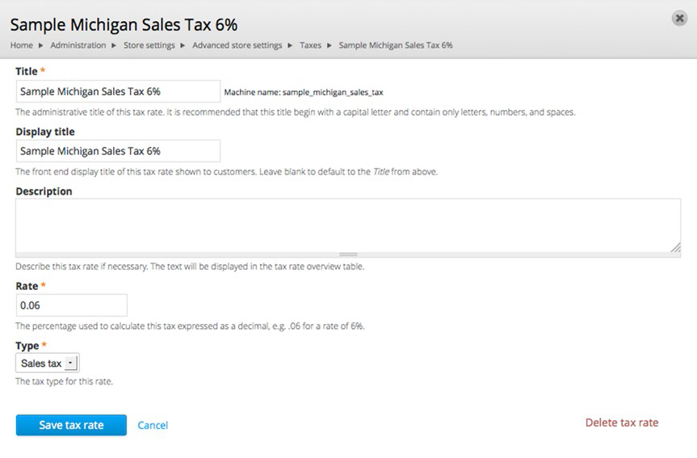

**图22-19 示例密歇根州销售税率**

如图22-19所示，定义一个新的税金的时候，你必须给它一个标题，其中管理标题会出现在管理页面，展示标题会在结算过程中显示，一个应用到订单中每一个产品的税率，以及税金的类型（销售税或者增值税）。这个页面上定义了税率的值，而第二步是定义这个税率如何应用。如果你点击“保存税率”按钮，你会返回到税金管理页面，点击“配置组件”链接，看看如何将税率运用到客户已经购买的商品（见图22-20）

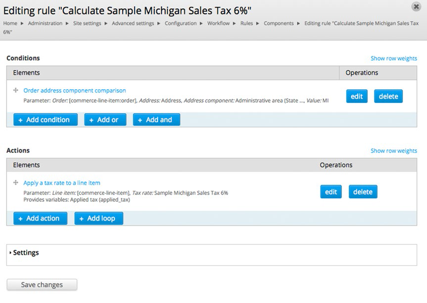

**图22-20 配置税金规则**

税金规则配置分为两个组件，一个使用规则所必须满足的条件，以及一个满足条件后将要执行的动作。在密歇根州销售税的例子中，条件是订单的“州”字段设置为“MI（密歇根州）”。在条件配置表单中（见图22-21），你可以找到一个“数据选择器”的字段，用来定义条件时基于哪个值，这个例子中是“commerce-line-item:order（电子商务行项：订单）”。地址字段允许你选择销售税是基于收货地址或账单地址。对于美国的税费，税率是基于账单地址的。“地址组件”允许你选择哪个字段用于比较，由于我们正在处理州销售税，我们选择的字段是“行政区域（州/省）”。我们希望用于比较行政区域的值的操作符是“等于”，并且最后的元素是，我们希望比较的值，本例中是“MI（密歇根州）”

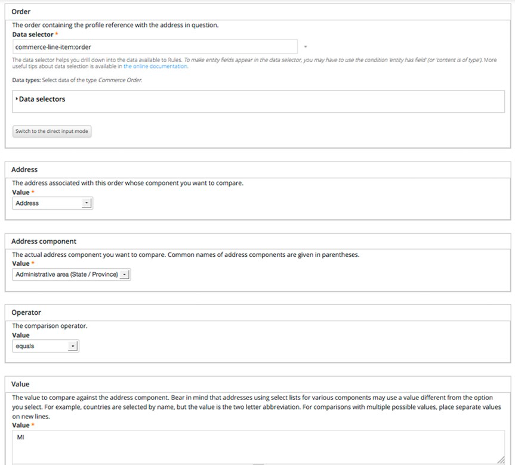

**图22-21 配置税金规则**

当你遇到郡税或者城市税时，你可以使用跟上述的州税相同的方法，选择郡或者城市作为比较的基准，使用郡或者城市的名字作为值。。要增加新税种，只需按照密歇根的例子来创建一个新的税率。你可以根据你配送的和你的公司经营的州，在网站上设置几个税率。请根据你所在州的规定征税以及报税。

### 支付

Drupal Commerce 为收取客户费用提供了几种方法，包括：信用卡支付，Paypal，亚马逊支付及其他方法。对于信用卡支付，你有一些支付服务（提供商）的选项，例如：Authorize.net, American Express, CyberSource, FirstData, Commerce SagePay, Commerce Cielo, Adyen, ePay, MoIP, Ogone, Pagamento, PageSeguro, PayEx, Payflow Link, PayLeap, PayPal, SagePay, and Sermepa。每一个支付服务都有自己的配置参数。请查看每个服务相关的模块文档以了解安装以及配置的具体细节。

出于演示网站的目的，我将使用Kickstart 默认启用的“示例支付”。你可以导航到“支付方式”的管理页面，检查对应的配置参数。为了达到这个目标，将鼠标悬停在管理菜单中的“保存设置”链接，然后点击下拉菜单中的“付款方式”链接。在“示例支付”的“Editing reaction rule（编辑响应动作）”的页面中，你将看到运费、支付是由事件以及动作管理。你可以查看“事件”和“动作”来看看启用支付方式的一般方法。

随着可购买产品，发货配置，税收启用和付款配置完成，是时候来下个订单。要选择一个项目（产品）来放到您的购物车，请点击在靠近页面顶部的菜单中列出的产品类型中的一个，并从该列表中单击该产品（你想要添加的产品）的名称，并选择属性，例如颜色和大小，如果适用于该产品，还有你想添加多少到你的购物车。添加项目到你的购物车后，你应该可以看到一个弹出通知，该项目已经添加到你的购物车（见图22-13）。在弹出通知上，点击“去收银台”按钮，开始结帐过程（见图22-22）。

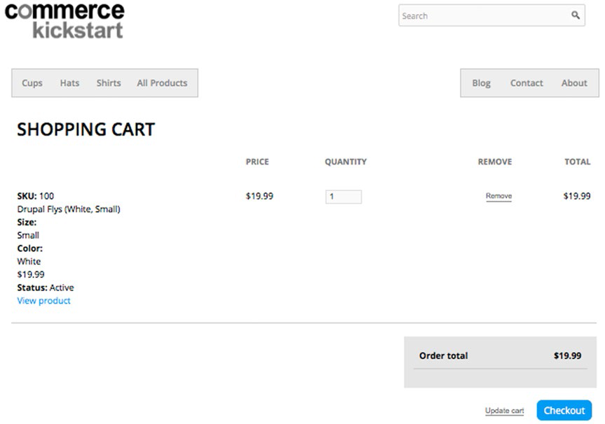

**图22-22 购物车**

如果在购物车中的物品和数量看起来是正确的，接着点击“结帐”按钮，进入计费和发货信息。对于所有订单来说，送货地址和帐单地址是需要的（可以是同一地址）。如果你是网站的回头客，并且已经登录，Drupal Commerce 通讯录模块会根据你在地址簿中存档的地址预填充一些值，这个档案是作为订单处理流程的一部分创建的。（见图22 -23）。

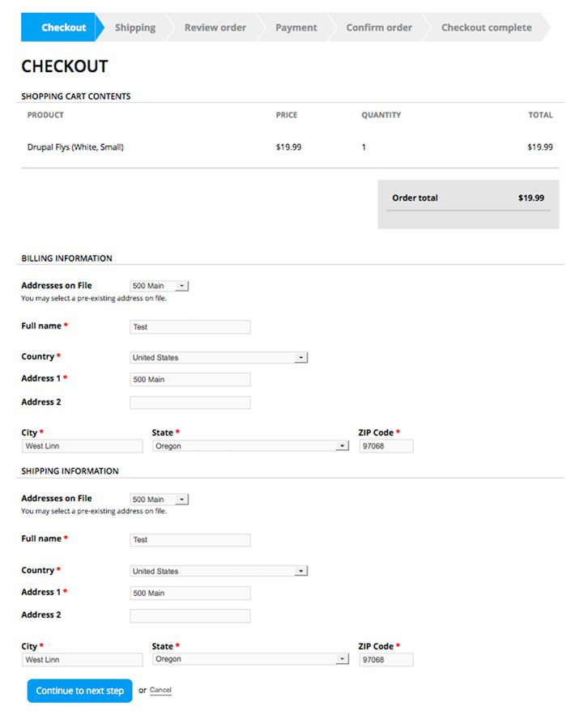

**图22-23 设置账单和送货地址**

点击“继续下一步”按钮，将显示结帐过程的“运送”步骤。因为我们只有实现了一个同一费率运送方式，所以这个页面上没有太多的要做。如果你已经实现了UPS，美国邮政，联邦快递或其他航运服务，并启用了多个送货选项（例如，标准陆运，第二天空运，为期2天的空运），购物者将有更多的选项以及从运营商的价格系统中获得的费用信息。运输成本是基于包裹的数量和订单的重量计算。

选择送货方式后，下一步是审查的订单并输入付款信息。使用 Kickstart 的“示例配送方法” 会预先生成一个示范的信用卡号码和到期日。如果您有其他付款方式，您可能还有其他的选项进行填写。下一步是进行付款并完成订单。结算完成的消息将会显示，包括给予购物者跟踪的订单号。
 
您可以修改通过管理界面结帐流程。将鼠标悬停在管理菜单中的“商店设置”项，然后点击“结帐设置”链接。你会看到的结账步骤列表以及它们在文档流中出现的位置（见图22-24）。您可以重新排列项目，但如果你这样做要谨慎，因为有些项目需要按顺序出现才能使功能生效（例如，支付处理后设置送货方式发生会导致配送费用不被列入了客户的支付中）。

**图22-24 配置结账流程**

## 本章小结
 
本章中，我介绍了安装 Drupal Commerce 以及配置店面的基本过程。还有许多额外的模块和技术用来建立和运营一个基于 Drupal Commerce 的网站。我建议你花时间在 Drupal.org 并且 查看一堆 专注于建立和运营 Drupal Commerce 店面的 Youtube 视频。

来到这里，你以及读完全书了。恭喜你！你的旅程才刚刚开始，我期待在你学习Drupal经验而进步的时候不断地看到你的作品。我希望在即将到来的 DrupalCon 或 DrupalCamp 上看到你。
